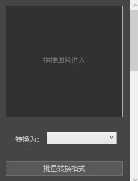
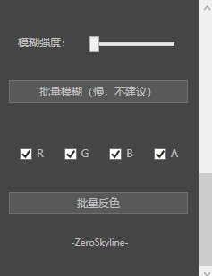

#  TextureWorker

#  软件界面：
  - 

  - 

  - 

#  介绍：

  1. 批量转换图片格式

  2. 批量转换图片分辨率

  3. 批量转换图片为灰度图

  5. 批量模糊图片

  6. 批量反色 （支持选择通道）

# [点我免费下载（适用于Window系统电脑）](https://github.com/PMZeroSkyline/WPF_TextureWorker/raw/main/TextureWorker/TextureWorker/bin/Release/TextureWorker.exe)

*本软件为一人开发 开源在GitHub 任何人都可以免费使用 没有广告 由 guzhang0@gamil.com 提供支持 欢迎错误反馈 欢迎到我的[ GitHub（点我进入） ](https://github.com/PMZeroSkyline)下载我的其它软件*

